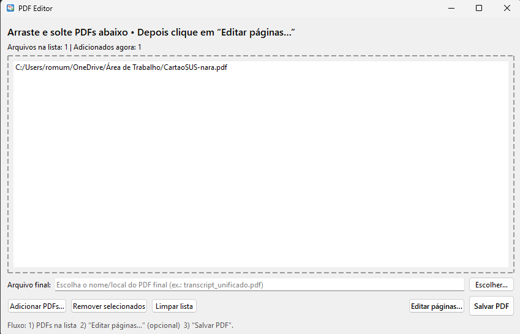

# PDF Merger & Page Editor 

Aplicativo desktop em **Python + PyQt6** para **juntar PDFs** com uma interface simples de **arrastar e soltar**, permitindo **editar a sequência de páginas antes de mesclar**.

✅ Recursos:
- Arrastar e soltar PDFs para a janela
- Selecionar nome e local do arquivo final
- **Editar páginas antes de juntar**:
  - Reordenar páginas (subir/descer)
  - Remover páginas
  - Rotacionar páginas (+90° / -90°)
  - Selecionar intervalos por arquivo (ex.: `1-3, 7, 10-12`)
- Exportar PDF final com um clique
- Ícone do app na janela e barra de tarefas (Windows, com AppUserModelID)

---

## Screenshot

---

## Executar sem instalar Python (Windows)
Se você só quer usar o app (sem rodar o código), basta:

1. Baixar a pasta **`dist/`** (ou a pasta onde está o build do executável).
2. Abrir essa pasta e executar o arquivo **`pdf_editor.exe`**.
